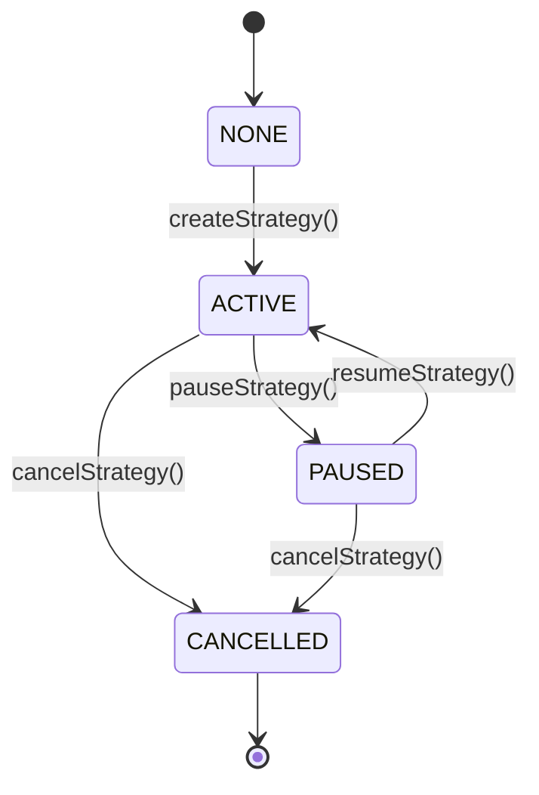

# Module 1 — DCA Strategy Management Layer

> **"Module 1 manages DCA strategy configuration and constraints. It does not make market decisions or execute trades."**

---

## 1. Module Purpose

Module 1 is the foundational strategy configuration and lifecycle registry of the Yield-Aware DCA system. It allows users to create, parameterize, pause, resume, cancel, and update dollar-cost averaging (DCA) strategies on-chain.

It acts as the single source of truth for:
- User-configured DCA strategy parameters and boundary constraints.
- Strategy lifecycle states (`ACTIVE`, `PAUSED`, `CANCELLED`).
- Scheduled execution timing and maximum delay window constraints.
- Read-only execution constraint validation for future decision and execution modules.

### Scope Boundaries
- **In Scope**: Strategy creation, parameter validation, lifecycle transitions, authorization, timing queries, and amount bound checks.
- **Explicitly Out of Scope**: ERC-4626 vault operations, fund custody or token transfers, DEX swaps (Uniswap / Uniswap v4 Hooks), price or TWAP oracles, volatility / yield analysis, and automated execution engines.

---

## 2. Architecture & System Flow

### System Flow
```text
      User
       │
       ▼
┌────────────────────────────────┐
│  Module 1                      │
│  DCA Strategy Management       │
│  (DCAEngine.sol)               │
└──────────────┬─────────────────┘
               │
               ▼
┌────────────────────────────────┐
│  Strategy State                │
│  (IDCAStrategy.Strategy)       │
└──────────────┬─────────────────┘
               │
               ▼
┌────────────────────────────────┐
│  [Future] Decision Engine      │
│  (Module 5)                    │
└──────────────┬─────────────────┘
               │
               ▼
┌────────────────────────────────┐
│  [Future] Execution Manager    │
│  (Module 6)                    │
└────────────────────────────────┘
```

### Full Modular System Roadmap
```text
                ┌─────────────────────┐
                │ Module 1             │
                │ DCA Strategy         │ ◄── [THIS MODULE]
                │ Management           │
                └──────────┬──────────┘
                           │
                           ▼
                ┌─────────────────────┐
                │ Module 2             │
                │ ERC-4626 Vault       │
                └──────────┬──────────┘
                           │
                           ▼
                ┌─────────────────────┐
                │ Module 3             │
                │ Market Analysis      │
                └──────────┬──────────┘
                           │
                           ▼
                ┌─────────────────────┐
                │ Module 4             │
                │ Yield Analysis       │
                └──────────┬──────────┘
                           │
                           ▼
                ┌─────────────────────┐
                │ Module 5             │
                │ Decision Engine      │
                └──────────┬──────────┘
                           │
                           ▼
                ┌─────────────────────┐
                │ Module 6             │
                │ Execution Manager    │
                └──────────┬──────────┘
                           │
                           ▼
                ┌─────────────────────┐
                │ Module 7             │
                │ Uniswap v4 Hook      │
                └─────────────────────┘
```

---

## 3. Core Strategy Data Model

A DCA strategy is represented by the `Strategy` struct in [`IDCAStrategy.sol`](src/interfaces/IDCAStrategy.sol):

| Field | Type | Mutability | Description |
| :--- | :--- | :--- | :--- |
| `owner` | `address` | **Immutable** | Address of the strategy creator with exclusive administrative rights. |
| `inputToken` | `address` | **Immutable** | ERC-20 token being invested/sold (e.g. USDC). Cannot be zero address. |
| `targetToken` | `address` | **Immutable** | ERC-20 token being acquired/bought (e.g. WETH). Cannot equal `inputToken`. |
| `targetAllocation` | `uint256` | **Modifiable** | Total configured budget/allocation for the DCA cycle. |
| `frequency` | `uint256` | **Modifiable** | Cadence between scheduled executions in seconds (must be `> 0`). |
| `maxDelay` | `uint256` | **Modifiable** | Maximum permitted delay window past `nextExecutionTime` in seconds (`> 0`). |
| `minExecutionAmount` | `uint256` | **Modifiable** | Minimum allowable execution order size. |
| `maxExecutionAmount` | `uint256` | **Modifiable** | Maximum allowable execution order size (`<= targetAllocation`). |
| `nextExecutionTime` | `uint256` | **System/Schedule**| Timestamp when the strategy is next eligible for execution. |
| `status` | `StrategyStatus` | **Lifecycle** | Current lifecycle state: `ACTIVE`, `PAUSED`, or `CANCELLED`. |

---

## 4. Strategy Lifecycle & State Machine



### Lifecycle Rules:
1. **Creation**: `createStrategy()` transitions `NONE -> ACTIVE`. Caller becomes `owner`.
2. **Pause**: `pauseStrategy()` transitions `ACTIVE -> PAUSED`. Only strategy owner can pause.
3. **Resume**: `resumeStrategy()` transitions `PAUSED -> ACTIVE`. Only strategy owner can resume.
4. **Cancellation**: `cancelStrategy()` transitions `ACTIVE -> CANCELLED` or `PAUSED -> CANCELLED`. Cancellation is permanent and irreversible. Cancelled strategies cannot be resumed, paused, or updated.
5. **Completion (`COMPLETED`)**: `StrategyStatus.COMPLETED` is retained in the enum for future accounting module compatibility. **Module 1 never marks strategies as `COMPLETED`**.

---

## 5. Execution Scheduling & 3 Timing States

```
 Timeline: 
 ───[ BEFORE DUE ]───|──────────[ EXECUTION WINDOW ]──────────|───[ OVERDUE ]───►
                     ▲                                        ▲
             nextExecutionTime                   nextExecutionTime + maxDelay
```

Module 1 exposes read methods to evaluate the temporal status of a strategy:

1. **BEFORE DUE (`block.timestamp < nextExecutionTime`)**:
   - The scheduled execution time has not arrived.
   - `isExecutionDue()` $\rightarrow$ `false`
   - `isExecutionWindowOpen()` $\rightarrow$ `false`
   - `isOverdue()` $\rightarrow$ `false`
   - `getRemainingDelay()` $\rightarrow$ `maxDelay`
2. **EXECUTION WINDOW (`nextExecutionTime <= block.timestamp <= nextExecutionTime + maxDelay`)**:
   - Strategy is due and within the user's allowed delay window.
   - `isExecutionDue()` $\rightarrow$ `true`
   - `isExecutionWindowOpen()` $\rightarrow$ `true`
   - `isOverdue()` $\rightarrow$ `false`
   - `getRemainingDelay()` $\rightarrow$ `(nextExecutionTime + maxDelay) - block.timestamp`
3. **OVERDUE (`block.timestamp > nextExecutionTime + maxDelay`)**:
   - The user's maximum allowed waiting window has expired.
   - `isExecutionDue()` $\rightarrow$ `true`
   - `isExecutionWindowOpen()` $\rightarrow$ `false`
   - `isOverdue()` $\rightarrow$ `true`
   - `getRemainingDelay()` $\rightarrow$ `0`

---

## 6. Business Concept: Target Allocation $\neq$ Execution Amount

In Yield-Aware DCA:
$$\text{Target Allocation} \neq \text{Actual Execution Amount}$$

- **Target Allocation** (e.g. 10,000 USDC) is the user's configured allocation constraint for the strategy.
- When an execution takes place in future modules, the **Decision Engine** may choose:
  - `EXECUTE` $\rightarrow$ 10,000 USDC
  - `PARTIAL_EXECUTION` $\rightarrow$ 6,000 USDC
  - `DELAY` $\rightarrow$ 0 USDC
- Module 1 does **NOT** decrement `targetAllocation` upon trade execution. Balance tracking, executed volume accounting, and completion checks are strictly managed by future execution/vault modules.

### Amount Validation Rules (`isValidExecutionAmount`):
- `amount > 0`
- `amount >= minExecutionAmount`
- `amount <= maxExecutionAmount`
- `amount <= targetAllocation`
- Strategy must be `ACTIVE`.

---

## 7. Validation Rules & Custom Errors

| Condition | Custom Error | Description |
| :--- | :--- | :--- |
| `inputToken == address(0)` | `ZeroAddressInputToken()` | Input token cannot be zero address. |
| `targetToken == address(0)` | `ZeroAddressTargetToken()` | Target token cannot be zero address. |
| `inputToken == targetToken` | `IdenticalTokens(token)` | Cannot trade token for itself. |
| `targetAllocation == 0` | `ZeroTargetAllocation()` | Allocation must be strictly positive. |
| `frequency == 0` | `ZeroFrequency()` | Frequency interval must be `> 0`. |
| `maxDelay == 0` | `ZeroMaxDelay()` | Maximum delay window must be `> 0`. |
| `minExecutionAmount == 0` | `ZeroMinExecutionAmount()` | Minimum execution size must be `> 0`. |
| `maxExecutionAmount == 0` | `ZeroMaxExecutionAmount()` | Maximum execution size must be `> 0`. |
| `minExecutionAmount > maxExecutionAmount` | `MinExecutionExceedsMax(min, max)` | Min size cannot exceed max size. |
| `maxExecutionAmount > targetAllocation` | `MaxExecutionExceedsAllocation(max, alloc)` | Max size cannot exceed allocation. |
| `minExecutionAmount > targetAllocation` | `MinExecutionExceedsAllocation(min, alloc)` | Min size cannot exceed allocation. |
| `firstExecutionTime > 0 && < block.timestamp` | `InvalidFirstExecutionTime(first, now)` | Past start times are rejected (0 defaults to `block.timestamp`). |
| Non-existent strategy access | `StrategyNotFound(strategyId)` | Strategy ID does not exist. |
| Non-owner modification | `NotStrategyOwner(id, caller, owner)` | Caller is not the strategy owner. |
| Invalid status transition | `InvalidStrategyStatus(id, current, expected)` | State transition is disallowed. |
| Action on cancelled strategy | `StrategyAlreadyCancelled(strategyId)` | Strategy is permanently cancelled. |

---

## 8. Security Model

- **Strict Strategy Ownership**: Every modifying function (`updateStrategy`, `pauseStrategy`, `resumeStrategy`, `cancelStrategy`) verifies `msg.sender == strategy.owner`.
- **Zero Custody / Zero Funds Movement**: Module 1 does not hold ERC-20 balances, execute transfers, or accept ETH deposits.
- **Immutable Asset Identity**: Token addresses and strategy owners cannot be altered after creation, preventing address substitution attacks.
- **Custom Errors**: Gas-efficient custom errors with parameterized debug context.

---

## 9. Project Structure

```text
c:\Users\prabu\Downloads\DCA\
├── src/
│   ├── DCAEngine.sol               # Core strategy management contract
│   ├── interfaces/
│   │   └── IDCAStrategy.sol        # Interfaces, structs, enums, errors, events
│   └── libraries/
│       └── DCAStrategyLib.sol      # Stateless validation and scheduling math library
├── test/
│   ├── DCAEngine.t.sol             # Contract integration, auth, state & fuzz tests
│   └── DCAStrategyLib.t.sol        # Library unit and boundary tests
├── script/
│   └── DeployDCA.s.sol             # Foundry deployment script
├── foundry.toml                    # Foundry build, optimizer & fuzz configuration
├── remappings.txt                  # Dependency import remappings
├── .env.example                    # Environment variable configuration template
├── .gitignore                      # Git ignore file
└── README.md                       # Comprehensive documentation
```

---

## 10. Local Setup & Build

### Prerequisites
- [Foundry / Forge](https://getfoundry.sh/) (Forge `v1.8.0+`)

### Build
```bash
forge build
```

### Test
Run the full test suite with verbose output:
```bash
forge test -vvv
```

### Format
```bash
forge fmt
```

---

## 11. Deployment Instructions

### 1. Configure Environment
Copy `.env.example` to `.env` and set your RPC URL and private key:
```bash
cp .env.example .env
```

### 2. Deploy to Local Anvil
Start local Anvil in a separate terminal:
```bash
anvil
```

Run the deployment script:
```bash
forge script script/DeployDCA.s.sol:DeployDCA --rpc-url http://127.0.0.1:8545 --broadcast
```

---

## 12. Current Limitations & Future Modules

### Current Limitations (By Architectural Design)
- Module 1 does not store user deposits or execute trades.
- Strategy `targetAllocation` is not decremented automatically upon execution.
- Strategies are not automatically marked as `COMPLETED` when fully executed.

### Future Modules
- **Module 2**: ERC-4626 Vault (yield generation while waiting for DCA intervals).
- **Module 3 & 4**: Market & Yield Analysis (TWAP, volatility, and opportunity cost models).
- **Module 5**: Decision Engine (`EXECUTE`, `PARTIAL_EXECUTION`, `DELAY`).
- **Module 6 & 7**: Execution Manager & Uniswap v4 Hook.
